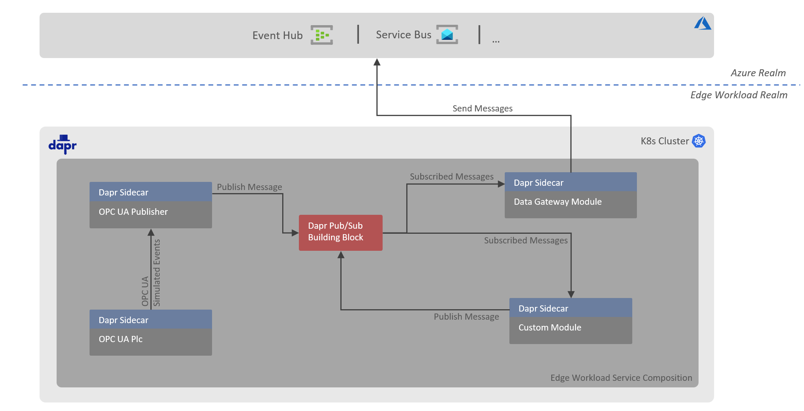

# Distributed Azure IoT Edge Workload Accelerator for K8s

[](https://github.com/suneetnangia/distributed-az-edge-framework/actions/workflows/CI.yml)

Edge computing comes in various forms, the spectrum of compute scale can vary hugely between use cases and industries. At the lower end of scale we have constrained devices like MCU (Micro Controller Units) and on the higher end we have heavy compute infrastructure which is processing images and high throughput data streams for anomalies. The latter is more frequent in manufacturing industry, these customers often provision high-density hosting platforms on the edge to deploy both cloud connected and locally managed workloads.

Azure IoT Edge provides an an easy on-ramp experience for light weight edge compute scenarios, if you do not need to scale-out or have a constraint to use Kubernetes(K8s), please consider using [IoT Edge](https://azure.microsoft.com/en-gb/services/iot-edge/) product instead. In fact, the path could be progressive i.e. customers may start small with single machine/industrial PC using Azure IoT Edge and progress to more scalable platform like Kubernetes later when the use-cases/adoption grows in/organically or the gravity towards it increases due to other collective reasons. If portability is the primary reason for running edge workloads on K8s, please consider using [KubeVirt approach](https://github.com/Azure-Samples/IoT-Edge-K8s-KubeVirt-Deployment) to deploy IoT Edge in a supported manner.

This repo provides an accelerator and guidance to enable those customer who wants to build edge solutions on K8s in a scalable and resilient manner. The solution makes use of native K8s constructs to deploy and run edge workloads. Additionally, the solution provides a uniform remote management/deployment plane for workloads which is provided via Azure Arc.

## Design

Following diagram shows the abstracted view of the overall solution approach:



Each pod contains two containers:

1. A custom code container running code/logic as defined by the developers.
2. A Dapr sidecar container which works as proxy to Dapr services and ecosystem.

Apart from the above arrangement, the following system modules/pods are part of the solution:

1. [**Data Gateway Module**](https://github.com/suneetnangia/distributed-az-edge-framework/wiki/Data-Gateway-Module), purpose of this module/pod is to route messages from pub-sub layer to the configured data store(s) in the cloud.
2. [**OPC UA Publisher Module**](https://github.com/suneetnangia/distributed-az-edge-framework/wiki/OPC-UA-Publisher-Module), OPC UA Publisher module to connect to OPC UA Plc module which simulates downstream devices/hubs in industrial IoT scenarios.
3. [**OPC UA Plc Module**](https://github.com/suneetnangia/distributed-az-edge-framework/wiki/OPC-UA-Plc-Module), OPC UA Plc module to simulate OPC UA telemetry from downstream devices to OPC UA Publisher module in industrial IoT scenarios.
4. [**Simulated Temperature Sensor Module**](https://github.com/suneetnangia/distributed-az-edge-framework/wiki/Simulated-Temperature-Sensor-Module), emits random temperature and pressure telemetry for testing purposes in a non OPC UA protocol.

The accelerator makes use of the following products and services:

### Azure Arc

[Azure Arc](https://docs.microsoft.com/en-us/azure/azure-arc/overview) enables the remote control plane for edge platform and provides the following inherent benefits:

1. Remote management plane for K8s cluster on the edge, including host management.
2. Desired state management for edge workloads, using Azure Arc's Flux CD extension in conjunction with K8s native constructs.
3. Standard application deployment model using K8s native constructs i.e. Helm/Kustomize.
4. Uniform deployment plane for both edge and other workloads on K8s.
5. Access to K8s cluster in offline mode via industry standard tools like Helm.

### Distributed Application Runtime ([Dapr](https://dapr.io/))

Dapr building blocks enable the cross-cutting amd non functional features which we are common in edge scenarios, some of those are mentioned below:

1. Local messaging with pub-sub functionality, optionally using standard [CloudEvents](https://cloudevents.io/).
2. Resilient communication between services and cloud endpoints, using [Circuit-breaker](https://docs.microsoft.com/en-us/azure/architecture/patterns/circuit-breaker) pattern.
3. Low latency and high throughput based service invocations, using [gRPC](https://grpc.io/) or Http RESTful mechanism.
4. Secure service to service communication, using mTLS or [SPIFFE](https://spiffe.io/docs/latest/spiffe-about/overview/).
5. Well known and understood configuration and secret management.
6. End to end observability at both application and platform level, using OpenTelemetry.

## Solution Deployment Steps

### Prerequisites

    1. Kubectl client, configured to a K8s cluster.
    2. Helm client

### Steps

1. Deploy Dapr on K8s cluster if not already deployed, please refer to the guidance [here](https://docs.dapr.io/operations/hosting/kubernetes/kubernetes-deploy/#install-with-helm-advanced).
2. Deploy Redis on K8s cluster if not already deployed:

    ```
    helm repo add bitnami https://charts.bitnami.com/bitnami
    helm repo update
    helm install redis bitnami/redis
    ```

3. Deploy the accelerator with the latest release, via Helm as below:

    ```
   helm repo add aziotaccl 'https://suneetnangia.github.io/distributed-az-edge-framework'
   helm repo update
   helm install az-edge-accelerator aziotaccl/iot-edge-accelerator --set iothubIntegrationModuleDevicePrimaryKey="<IoTHub Device Connection String>",simulatedTemperatureSensorFeedIntervalInMilliseconds=3000
    ```

## Outstanding (Work in Progress)

### Performance
1. Impact of making use of CloudEvents.
2. Performance test accelerator components e.g. Dapr components as well as custom ones.

### Management Plane

1. Guidance on how to manage edge workloads in nested/ISA 95 scenarios.

### Others

1. Develop multi ML model execution engine/design (potentially using [pipe and filter pattern](https://docs.microsoft.com/en-us/azure/architecture/patterns/pipes-and-filters) in a single pod/container).

### Stretch

1. Develop capability to run Web Assembly based modules using [Krustlet](https://github.com/krustlet/krustlet).

## Disclaimer

This is still a work in progress, you are however free to use this to guide your thinking to develop a solution for your own use. Equally, we would welcome any contribution you could make to progress this work.
